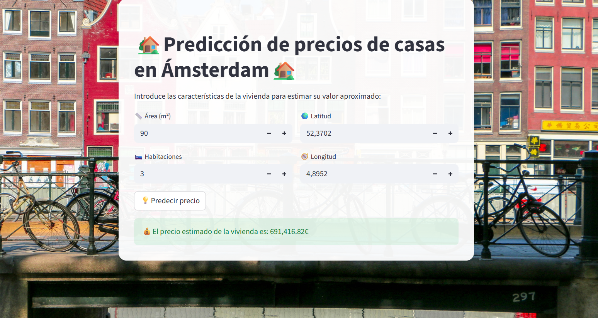

# 🏡 Predicción de precios de viviendas en Ámsterdam

Este proyecto tiene como objetivo predecir el **precio estimado de una vivienda en Ámsterdam** en base a sus características principales: el área, el número de habitaciones y la ubicación geográfica (latitud y longitud).  
La aplicación está implementada con Streamlit, lo que permite realizar las predicciones de una manera sencilla mediante una interfaz web interactiva.

---

### 🚀 Tecnologías utilizadas

- **Python 3.10+**  
- **Pandas** — manipulación de datos  
- **Scikit-learn** — entrenamiento y evaluación del modelo  
- **Joblib** — guardado y carga del modelo entrenado  
- **Streamlit** — interfaz web interactiva  
- **Matplotlib / Seaborn** — visualización y gráficos

---

### 📦 Estructura del proyecto

```plaintext
📁 Proyecto-predicci-n-casas-Amsterdam
│
├── app/
│ └── app.py # Aplicación Streamlit
│
├── model/
│ └── best_model_rf.pkl # Modelo Random Forest entrenado
│
├── data/
│ └── data_cleaned.csv # Datos tras limpieza y preprocesamiento
│ └── data_raw.csv # Datos en crudo
│
├── images/
│ └── amsterdam.jpg # Fondo de la app
│ └── captura.png # Captura de pantalla de la app
│
├── scripts/
│ └── experimentos_sucio.ipynb # Notebook del proyecto completo
│ └── EDA.ipynb # Notebook de la parte de EDA
│ └── preprocessing&feature.ipynb # Notebook de la limpieza, preprocesamiento y feature engineering
│ └── training and hyperparameters.ipynb # Notebook del entrenamiento y ajuste de hiperparámetros
│ └── train_model.py # Entrenamiento de modelos
│ 
├── requirements.txt # Dependencias del proyecto
└── README.md # Este archivo
```

---

### ⚙️ Instalación y ejecución de la aplicación

1. **Clonar el repositorio**

   ```bash
   git clone https://github.com/paulabeltran2101/Proyecto-predicci-n-casas-Amsterdam.git
   cd Proyecto-predicci-n-casas-Amsterdam

2. **Crear entorno virtual**
   ```bash
   python -m venv env
   .\env\Scripts\activate      # En Windows
   source env/bin/activate     # En macOS / Linux

3. **Instalar dependencias**
   ```bash
   pip install -r requirements.txt 
   ```

4. **Ejecutar la app**
   ```bash
   streamlit run app/app.py
   ```

---

### 🧠 Modelo de predicción

El modelo entrenado y utilizado en las predicciones es un **Random Forest Regressor**, optimizado mediante el método de validación cruzada (cross validation).  

Las variables utilizadas son:
  - `Area` — superficie en metros cuadrados  
  - `Room` — número de habitaciones  
  - `Lat` — latitud  
  - `Lon` — longitud  

El modelo se guardó en formato `.pkl` utilizando Joblib para integrarse fácilmente en la app de Streamlit.

---

### 💻 Interfaz Streamlit

La aplicación solicita los siguientes datos del usuario:
    - 🏠 **Área (m²)**  
    - 🛏️ **Habitaciones**  
    - 📍 **Latitud**  
    - 🌍 **Longitud**
  
y muestra una predicción del **precio estimado en euros (€)**.

- Enlace para ver la aplicación en funcionamiento ➡️ <a href="https://paulabeltran2101-proyecto-prediccion-casas-amsterdam.streamlit.app" target="_blank">Link a Streamlit Cloud</a>

---

### 📊 Ejemplo de uso


